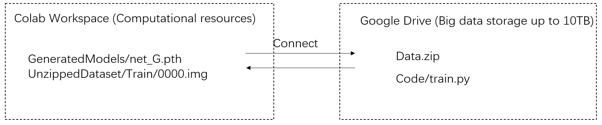

# Colab Pro+
RAM: ~51GB.

Disk: ~166GB.

Possibly allocated GPU: Tesla V100 / Tesla P100.

# Small Tips
- If not allocated with V100, disconnect the session and try with luck again.
- Loading data from Google Drive is very slow, put your dataset in Colab Workspace.
- Small files will slow down the transfer speed between Google Drive and Colab Workspace, make sure files are zipped before transferring.
- It is extremely slow to directly zip/unzip files on Google Drive. 
- Colab internet speed is very fast, consider [wget](https://www.gnu.org/software/wget/) to download datasets online.
- It is possible files break when transferring between Google Drive and Colab Workspace, just try it again.

# Sample Usage
See [Template](https://github.com/ruijieren98/google_colab_config/blob/main/Machine_Template.ipynb).
